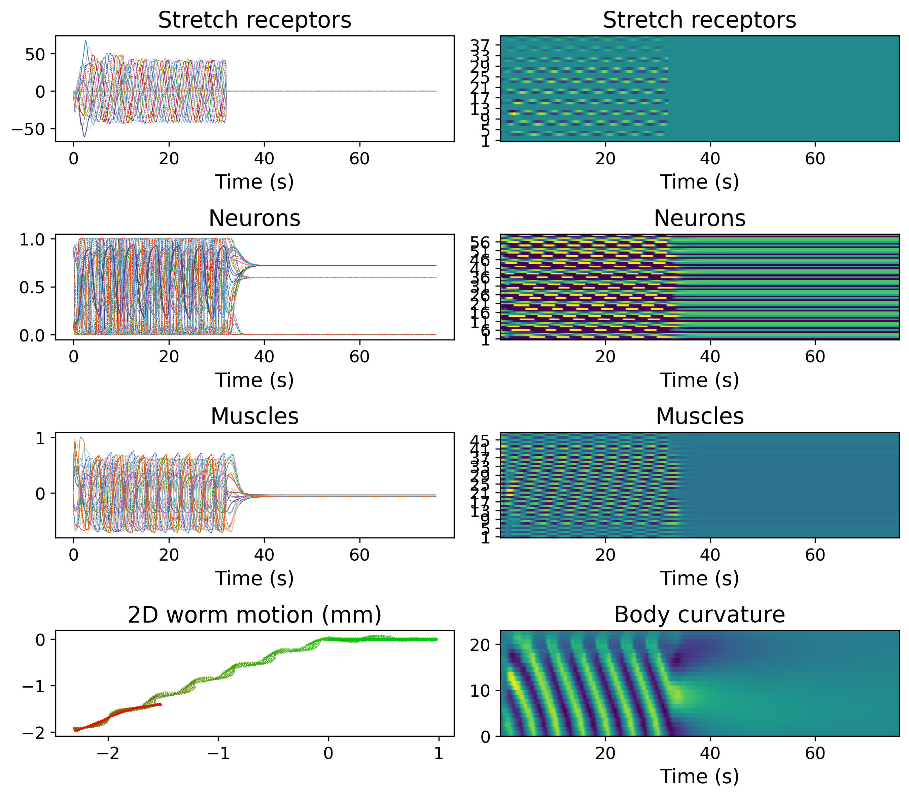

# Worm2D

Worm2D is a neuromechanical simulator of *C. elegans* locomotion. This is an initiative of the [OpenWorm project](https://www.openworm.org). It is based on earlier work on development of 2D worm neuromechanical models of Netta Cohen and team, as well as Dr. Eduardo J. Izquiredo, Dr. Erick Olivares and Prof. Randall Beer (See [HISTORY.md](HISTORY.md)).

Worm2D is a hybrid C++/Python package: C++ binaries implement the physics, nervous system, and evolutionary search, while Python handles configuration, binary dispatch, and post-run analysis/plotting. 


## Build & Install

The package uses [scikit-build-core](https://scikit-build-core.readthedocs.io/) with CMake. nlohmann-json is bundled as a header at `src/cpp/nlohmann/json.hpp` — no system package needed.

Install in editable mode (builds C++ and installs Python package):

```bash
pip install -e .[all]
```

The `[all]` extra pulls in `[neuroml]` (pyNeuroML, NEURON<9.0) and `[dev]` (ruff, pytest, ipywidgets, OSBModelValidation, modelspec).

## Running Tests

Quick test (runs after `pip install -e .`):

```bash
python tests/test.py # runs a single optimisation run & saves output to exampleRun folder, see below
```




Full test suite (cleans prior run folders, then runs all model variants and OMV tests):

```bash
./test_all.sh        # full
./test_all.sh -q     # quick (skips OMV and most model-specific tests)
```

Individual test scripts in `tests/` and `src/worm2d/` follow the naming pattern `test<ModelVariant>.py`. Run any directly:

```bash
cd tests
python testW2DCE.py
```


## CLI

After install, the `worm2d` command is available:

```bash
worm2d -f <outputFolder> [-E] [-O <modelName>] [-T <modelFolder>] [...]
```

Key flags: `-E` / `--doEvol` runs the evolutionary search; `-f` specifies the output folder (required); `-O` sets the model name when using the `Worm2D` binary family.
